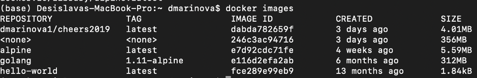
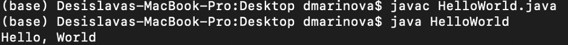
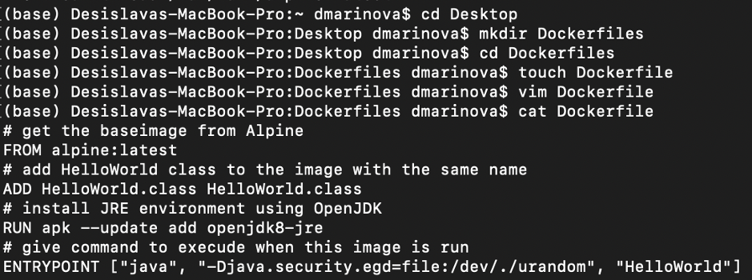

# BSP-S6-Containerisation
This is a Bachelor Semester Project on "Containerisation of services" with domains on Cloud Computing, Docker, Kubernetes

# **Docker Tutorial**
This tutorial was built using [Java Code Geeks Docker Hello World Example](https://examples.javacodegeeks.com/devops/docker/docker-hello-world-example/) and [Docker for Mac Docs](https://docs.docker.com/docker-for-mac/)

## Objectives:
The objectives are:
-	To setup Docker 
-	To run Docker container and build an image

## Docker setup

### 1.	Go to Docker Hub and create an account if you do not have any.
https://hub.docker.com
### 2.	Download Docker Desktop for the system you are operating on (Windows, macOS, etc.) 
### 3.	Install Docker Desktop.
- Double-click Docker.dmg to open the installer, drag the Docker icon to the Applications folder.
- Double-click Docker.app in the Applications folder to start Docker. You are prompted to authorize Docker.app with your system password after you launch it. Privileged access is needed to install networking components and links to the Docker apps.
- The Docker menu in the top status bar indicates that Docker Desktop is running, and accessible from a terminal.
- Once you are done installing Docker, test your Docker installation by running the following Docker hello-world image:
``` 
$ docker run hello-world
Unable to find image 'hello-world:latest' locally
latest: Pulling from library/hello-world
03f4658f8b78: Pull complete
Digest: sha256:8be990ef2aeb16dbcb9271ddfe2610fa6658d13f6dfb8bc72074cc1ca36966a7
Status: Downloaded newer image for hello-world:latest
	
Hello from Docker.
This message shows that your installation appears to be working correctly.
...
```
    
### 4.	Get started with Docker Desktop for Mac
- Running our first “Hello World” container using an Alpine Linux container (a lightweight linux distribution) on our system. We run the following in our terminal:
```$ docker pull alpine```
The pull command fetches the alpine image from the Docker registry and saves it in our system. We can use the docker images command to see a list of all images on your system.
```$ docker images```


We can run a Docker container based on this image. To do that we are going to use the docker run command:

```$ docker run alpine ls -l
total 56
drwxr-xr-x    2 root     root          4096 Jan  2 21:52 bin
drwxr-xr-x    5 root     root           340 Feb 18 08:24 dev
drwxr-xr-x    1 root     root          4096 Feb 18 08:24 etc
drwxr-xr-x    2 root     root          4096 Jan  2 21:52 home
drwxr-xr-x    5 root     root          4096 Jan  2 21:52 lib
......
......
```
When we run $ docker run alpine with command (ls -l), Docker starts the specified command and shows the listing.

### 5. Get a “Hello, world” Printed from Another Basic Docker Image:
1)
```
$ docker run alpine echo "hello from alpine"
hello from alpine
```

2)
```$ docker run alpine:latest "echo" "Hello, World"```

The second command downloads the Alpine baseimage the first time and creates a Docker container. Then runs the container and executes the echo command. The echo command echoes the “Hello, World” string.  As a result, you should see the output as below.

### 6. Docker containers

Using the docker ps command we can see all containers that are currently running.

```
$ docker ps
CONTAINER ID        IMAGE               COMMAND             CREATED             STATUS              PORTS               NAMES
```
Since no containers are running there is a blank line. A more useful variant: 
```docker ps -a```

What we see above is a list of all containers that we ran. Notice that the STATUS column shows that these containers exited a few minutes/seconds ago. 

There is a way to run more than just one command in a container with:
```$ docker run -it alpine /bin/sh```

Running the run command with the -it we deploy flags interactivity in the container. Now we can run as many commands in the container as we want. Take some time to run your favorite commands.
To find out more about run command, we can use docker run --help to see a list of all flags it supports. 

### 7. Create HelloWorld.java

First, we create a simple Java program that prints “Hello, World” (a program very closely resembling the one provided in the Official Java tutorial).  Open up any text editor and enter the following code:
```	
public class HelloWorld {
    public static void main(String[] args) {
        System.out.println("Hello, World");
    }
}
```
- Save the file as HelloWorld.java.  
- compile this file using the Java compiler to create the class file Helloworld.class
```$ javac HelloWorld.java```
To execute the Hello World with Java:


However, the aim is to run this from within a Docker container.  To accomplish that we need to create a Docker image. 

### 7. Create a Dockerfile in order to create a Docker image.
A Dockerfile defines a docker image.

We shall use the Command Line tool.

- Open Terminal. 
- Go to your Desktop with command ```cd Desktop```
- Create a folder called “DockerFiles” with the command ```mkdir DockerFiles```
- Go inside the folder with command ```cd DockerFiles ```
- Create a Dockerfile with command ```touch Dockerfile ```
- Edit the Dockerfile with command ```vim Dockerfile```
- Inside the vim editor press "I" on the keyboard to go inside the “insert” mode. Type the instructions:

```
# get the Alpine baseimage
FROM alpine:latest
# add HelloWorld class to the image with the same name
ADD HelloWorld.class HelloWorld.class
# install JRE environment using OpenJDK
RUN apk --update add openjdk8-jre
# give command to execute when this image is run
ENTRYPOINT ["java", "-Djava.security.egd=file:/dev/./urandom", "HelloWorld"]
```
Press Esc and type ```:wq!``` to exit

To see contents of Dockerfile type ```cat Dockerfile```

- Build/Create the image using command with a dot at the end (if inside the repository of the Dockerfile): 
```$ docker build .```
- Or, if not inside the location of Dockerfile, type:
```$ docker build /Users/username/Desktop/DockerFiles/ .```
- Or tag your image/give your image name (syntax format is docker build -t imageName:imageTag), i.e. with command:
```$ docker build --tag "docker-hello-world:latest" .```
- Run the command. See message “Successfully built” followed by the image ID


- Check your images with ```docker images``` and note that your image is there.
- Run your image and see the message “Hello, World” displayed:
```$ docker run docker-hello-world:latest```


# GLOSSARY v0.1

## Docker:
- an open platform, written in Go language, for sharing, shipping, and running apps;
- allows to separate apps from our infrastructure to deliver software quickly; 
- we can package and run an app within a container which provides security and isolation to run many containers on a host;
- manages the lifecycle of containers

## Container:
- loosely isolated environment; 
- a runnable instance of an image; defined by its image as well as configuration options provided when we created/started it; if container removed, any changes to its state, not stored in persistent storage, disappear;  
- lightweight since it does not need a hypervisor; it runs directly within the kernel of host machine; for this reason, there is the possibility to run more containers than virtual machines (VMs) on given hardware combination; it can be run within host machines that are actually VMs; relatively well isolated from other containers and its host machine; 
- using Docker API or CLI we can create, start, stop, move or delete a container;
- containers can be connected to one or more networks, attach storage to it or create a new image based on its current state; 
- the use of containers to deploy applications is called containerisation

-> containerisation is increasingly popular because containers are flexible, lightweight, portable, loosely coupled, scalable, secure;

## Virtual Machine (VM):
- resembles a physical machine since it has CPU, memory, disk to store files, can connect to Internet if needed, however, it exists only as code, a software defined computer running on top of a hypervisor; 
- a software that allows to run OS within another OS (e.g. VirtualBox, VMware)

## Hypervisor:
- a software that exists between a physical hardware and the VM; 
- ensures each VM receives the resources it needs in an orderly manner (e.g. in case of Google Cloud, VMs are running in the cloud)

## Cloud:
- a network of powerful servers running hypervisors in data centres all over the world; 
- the Internet is used to access information and services running on the cloud from app, browser, device;

## Docker Engine: 
- a client-server application with the following components:
	- server which is a long-running program called a daemon process (```dockerd``` command)
	- REST API specifying interfaces that programs can use to talk to the daemon and instruct it what to do
	- a command line interface (CLI) client (the ```docker``` command) which uses the REST API to control/interact with the docker daemon through scripting or direct CLI commands

## Docker daemon (```dockerd```):
- listens for Docker API requests and manages Docker objects; can communicate with other daemons to manage Docker services

## Docker client (```docker```): 
- this is the primary way Docker users interact with Docker; the client can send commands to ```dockerd``` to carry them out using the command ```docker run```; 
- docker command uses the Docker API; 
- the client can communicate with more than one daemon

## Docker registries
- stores Docker images; 

For instannce, ```Docker Hub``` is a public registry that anyone can use and Docker looks for images on Docker Hub by default; 
the commands ```docker pull``` or ```docker run``` pull the required images from the configured registry; 
the command ```docker push``` pushes the image to our configured registry

## Docker objects: 
- can be images, containers, networks, plugins, volumes, etc.

## Image:  
- a read-only template/package with instructions for creating a Docker container; often an image is based on another image with additional customisation; we can either create our own image or use images created by others published in a registry; 
- to build our own image we create a ```Dockerfile```, with a simple syntax for defining the steps needed to create the image and run it; 
- each instruction in Dockerfile creates a layer in the image; when changing and rebuilding the Dockerfile, only those layers which have changed are rebuilt;
- all these make the images lightweight, small and fast when compared to other virtualisation technologies

## Namespaces 
- a technology providing isolated workspace called the container; 
- when running a container, Docker creates a set of namespaces for that container that provide a layer of isolation; 
- each aspect of a container runs in a separate namespace and its access is limited to that namespace;
	
	The Docker Engine uses the following namespaces:
	- the ```pid``` namespace: process isolation (PID: Process ID)
	- the ```net``` namespace: managing network interfaces (NET: Networking)
	- the ```ipc``` namespace: managing access to IPC resources (IPC: InterProcess Communication)
	- the ```mnt``` namespace: managing filesystem mount points (MNT: Mount)
	- the ```uts``` namespace: isolating kernel and version identifiers (UTS: Unix Timesharing System)

## Control groups: 
- a technology ```cgroup``` limiting an app to a specific set of resources; cgroups allow Docker Engine to share available hardware resources to containers and optionally enforce limits and constraints (e.g limiting the memory available to a specific container)

## Union file systems or UnionFS:
- are file systems that operate by creating layers making them lightweight and fast; Docker Engine uses ```UnionFS``` to provide the building blocks for containers

## Container Format:
- a wrapper/combination of namespaces, control groups and UnionFS. Default container format is ```libcontainer```


## Instructions used in tutorial for Dockerfile

```FROM``` sets the Base Image for subsequent instructions.

```ADD``` copies new files, directories or remote file to container.

```RUN``` execute any commands in a new layer on top of the current image and commit the results.

```ENTRYPOINT``` configures a container that will run as an executable.


# REFERENCES:

1) Docker docs. Docker Overview. URL: https://docs.docker.com/engine/docker-overview/ 

2) Docker docs. Orientation and setup. URL: https://docs.docker.com/get-started/ 
